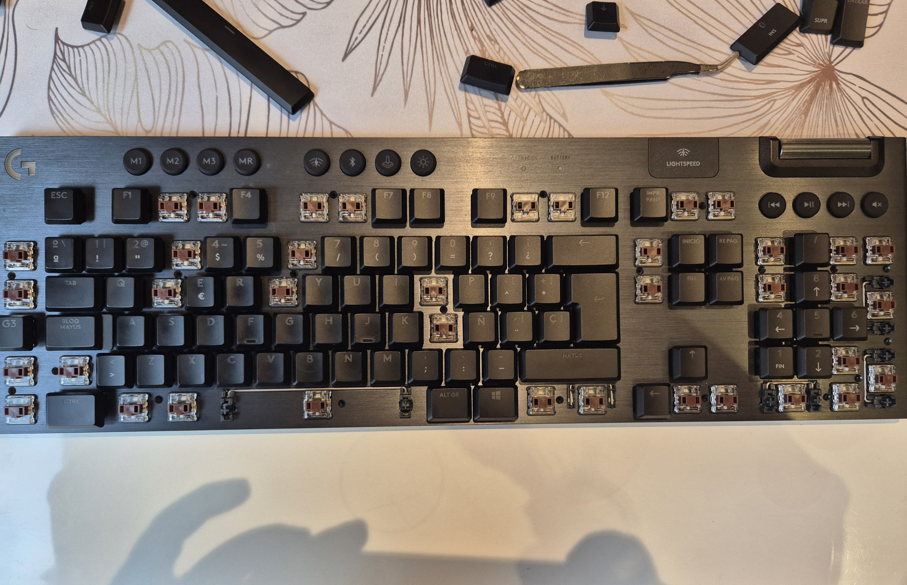
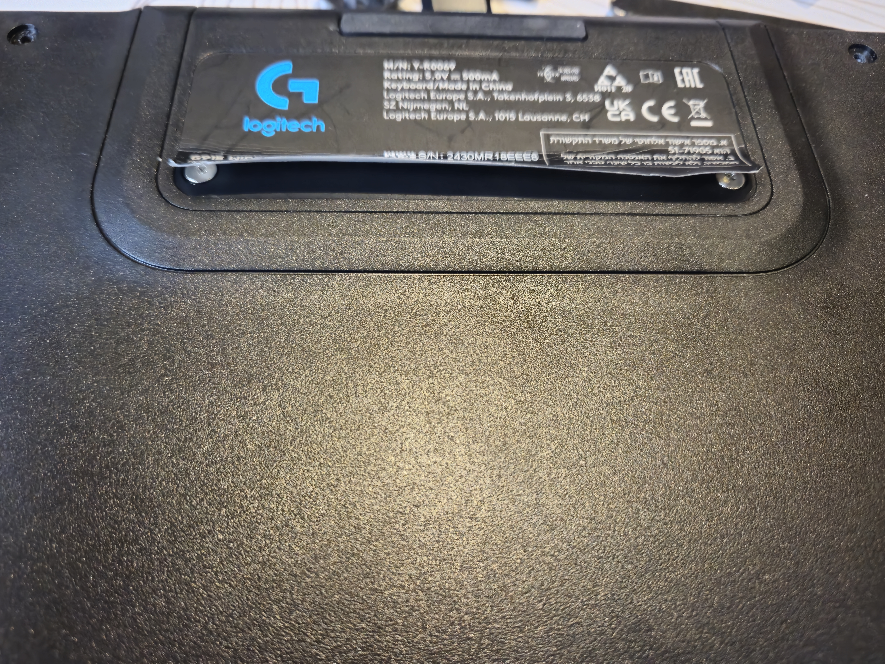
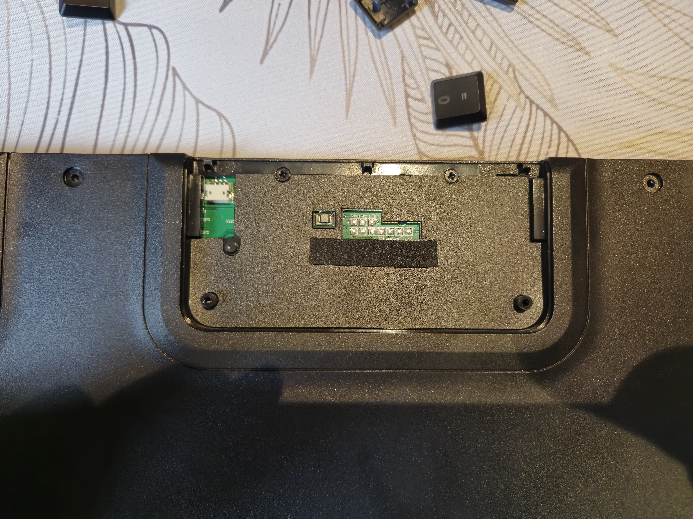
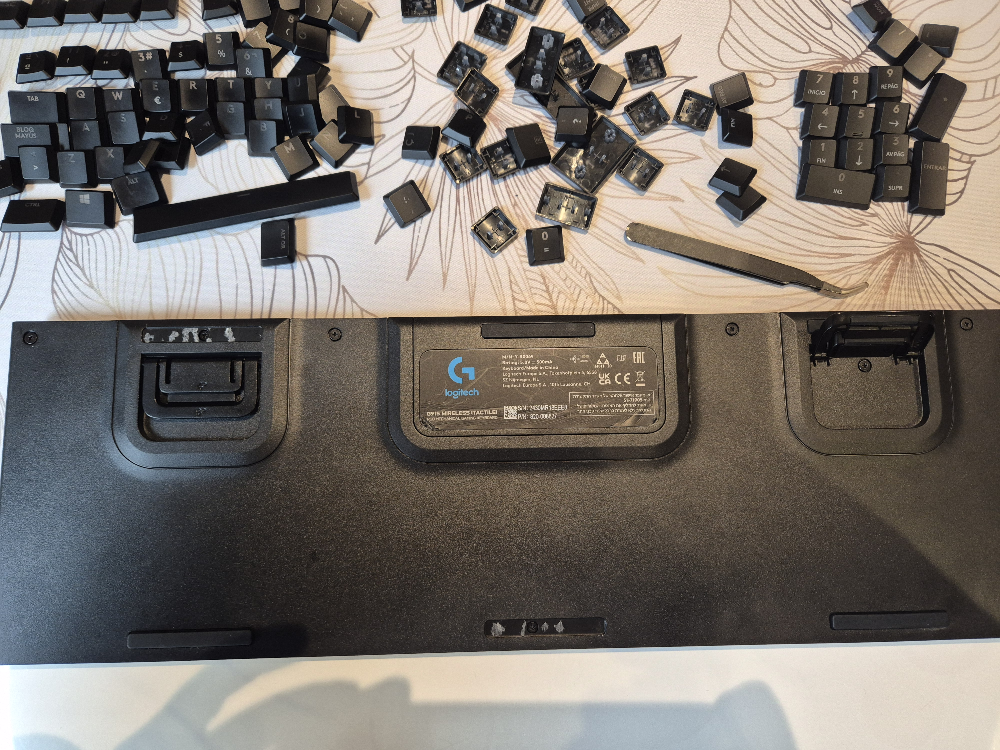
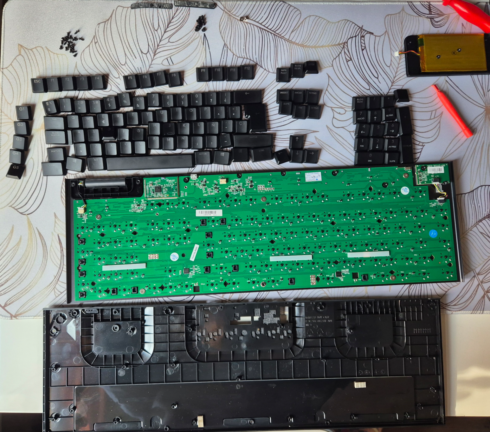
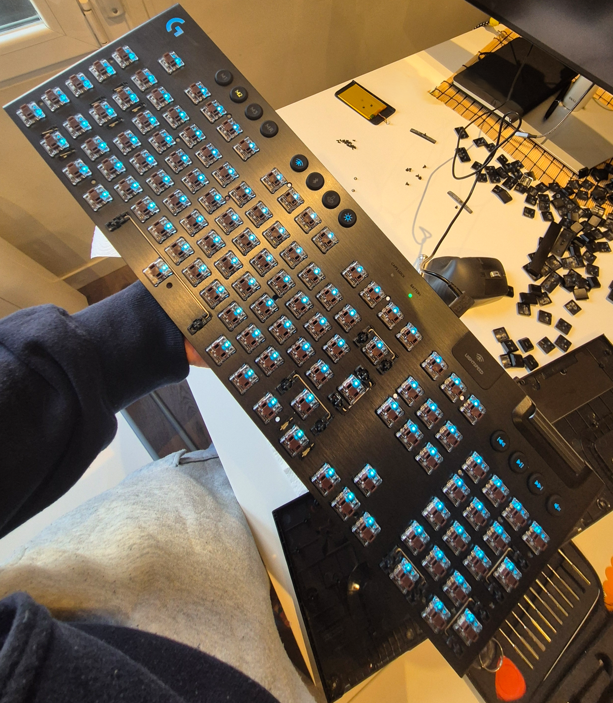

Es gracioso que mi primer artículo en el blog sea fruto de la torpeza, que tanto me caracteriza, pero por algo hay que empezar.

El problema que tuve es que se me cayó un vaso de agua sobre mi teclado, o EL TECLADO, el modelo es el logitech g915 tactile que me regalaron para mi último cumpleaños y que me encanta. En ese momento, entré en pánico, así que os voy a contar lo que yo hice y, de paso, explicar los pasos para desmontarlo. ¡Allá vamos!

## Qué hice cuando se mojó el teclado
Lo primero, llorar un poquito, que siempre viene bien (pero procura no hablarte a ti misma demasiado mal).

Una vez pasado el shock inicial, actué rápido: apagué el teclado para evitar cortocircuitos y le di la vuelta para que el agua saliera y no siguiera entrando.

Después de unos minutos, cuando dejó de gotear, le quité todas las teclas y las sequé una a una. Ahí me di cuenta de que en algunos conectores todavía había agua, así que la sequé con cuidado. Pero no me gustó lo que vi... Aún así, sequé todo y probé a encenderlo. ¡Oh no! Pánico total, no encendía.

Bueno Raquel, no desesperes vamos a ensuciarnos un poco las manos y a secarlo bien por dentro.

La verdad es que tenía serias dudas. Siempre me ha gustado desmontar cualquier cacharro electrónico, pero el teclado tenía solo 3 meses, así que sabía que desmontarlo implicaba perder la garantía. Pero, seamos sinceros, la garantía ya estaba perdida si no encendía por haberse mojado.

## Desmontar el teclado G915

Para esto hay muchos tutoriales. Siempre me gusta echar un vistazo a la web [ifixit](https://es.ifixit.com/Device/Logitech_G915_TKL) donde la comunidad ayuda a que la obsolescencia no sea tan obsoleta y explica, a modo de tutorial, cómo arreglar los cacharros. No había una guía específica para este modelo, pero no podía ser muy diferente de otros Logitech G915, así que me sirvió como base.

Las herramientas necesarias son básicamente destornilladores y unas pinzas. Si no tienes un kit, te recomiendo hacerte con uno. El mío es de AliExpress, así que para cacharrear en estos casos es una maravilla.

### Paso 1: Quitar todas las teclas (o las necesarias)

Yo quité todas las teclas porque no sabía dónde estaban los tornillos de la parte superior. Pero, para que no tengáis que hacer lo mismo que yo, os dejo una foto con la ubicación de los tornillos por si solo queréis quitar las teclas necesarias. Aunque, en un caso como este de agua, mejor quitar todo para que el agua fluya libremente.

### Paso 2: Quitar la batería.

Para quitar la batería y poder trabajar con tranquilidad, sabiendo que no hay corriente en la placa, hay que despegar la etiqueta trasera. Con solo un poco basta para quitar los dos tornillos que la sujetan.

Si quieres que sea más fácil despegar la etiqueta, dale un poco de calor. Lo mejor es usar una placa de calor, pero si no tienes, puedes usar un secador o una manta eléctrica. Cualquier cosa que no genere humedad.

Una vez despegada la etiqueta, quitamos los dos tornillos y separamos la batería para desconectarla.

### Paso 3: El resto de tornillos traseros.

Vamos a quitar el resto de tornillos traseros. Hay algunos bajo las almohadillas antideslizantes. Te dejo aquí una foto para que veas dónde están. También hay dos más en el compartimento que hemos abierto de la batería.
|  |  |
| --------------------------------------------------------------------------- | ------------------------------------------------------------------------------------------- |

### Paso 4: La placa a la vista.

Ya tenemos todos los tornillos fuera, y es hora de ver la placa por dentro. ¡Uooooo! Cuidado al desmontar porque el embellecedor del interruptor se puede caer, así que tenlo localizado.

No deberías hacer ningún tipo de fuerza para quitar la carcasa inferior, así que si ves que se te resiste, revisa que hayas quitado todos los tornillos.

Con la placa a la vista, yo también desconecté la luz del logo y la ruleta de sonido. ¿Por qué? Pues no sé, será por inercia de ver unos conectores y asegurarme de aislar al máximo todo.

### Paso 5: Vamos a secar y volver a secar

Al llegar a este punto, todavía había algo de agua, así que volví a secar bien. Si tienes alcohol isopropílico, puedes usarlo para limpiar todo y eliminar la humedad.

Yo lo sequé bien y lo dejé un rato al aire. Hay quien dice que no hay que usar el secador en estos casos, pero yo lo usé al mínimo para sacar el agua que hubiese. Eso sí, te recomiendo que no le des muy de cerca con el calor, que no lo dejes fijo en un punto y que siempre lo muevas para evitar problemas. Si lo usas así, todo irá bien.

Lo volví a dejar al aire y repetí la operación hasta que no salía ni una gota por ningún sitio.

### Paso 6: Vamos a comprobar que todo funciona.

Si ya te sientes con la suficiente seguridad de volver a intentarlo, prueba a enchufar el teclado por cable y encenderlo. ¡Y voilà! Con suerte, todo funcionará con normalidad. Prueba que la luz, los botones de sonido y las teclas funcionen correctamente.

### Paso 7: Volver a montar y volver a comprobar

Ahora vuelve a montarlo todo con cuidado. Vuelve a conectar la rueda del volumen, asegurándote de no doblar ningún pin (como me pasó a mí y tuve que investigar qué había pasado), y la luz. Puedes volver a comprobar antes de atornillar que todo funcione con el sonido y la luz.

## Tips y briconsejos

- No bebas cerca del teclado. Bueno, con el teletrabajo y tantas horas delante de la pantalla, es inevitable muchas veces. En cualquier caso, ten cuidado.
- Mantén la calma. Lo primero es desconectar y secar lo más rápido posible para evitar oxidaciones, que en estos cacharros son muy rápidas.
- Sé ordenada al desmontar. Separa los diferentes tipos de tornillos para no liarla.

Espero que este artículo te sirva y que, si alguna vez te pasa algo similar, no entres en pánico. ¡Y recuerda, siempre hay solución (o casi siempre)!

